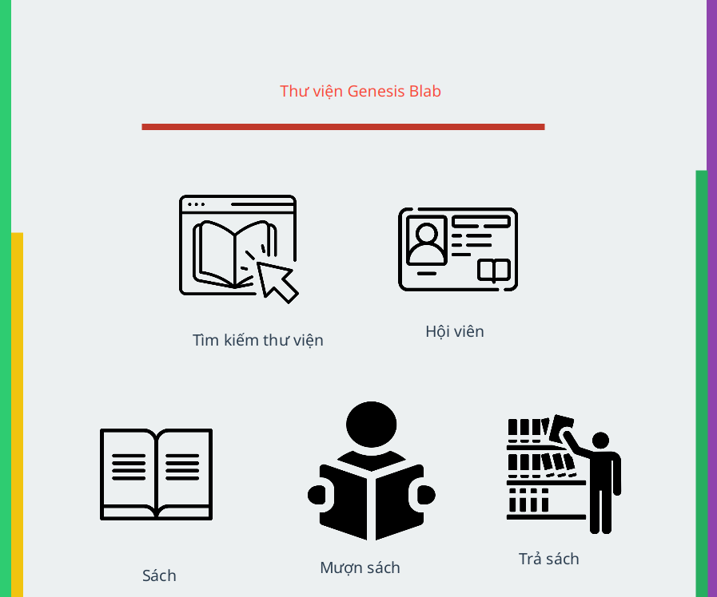
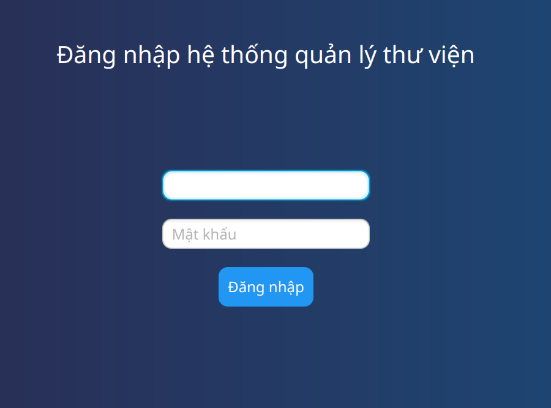
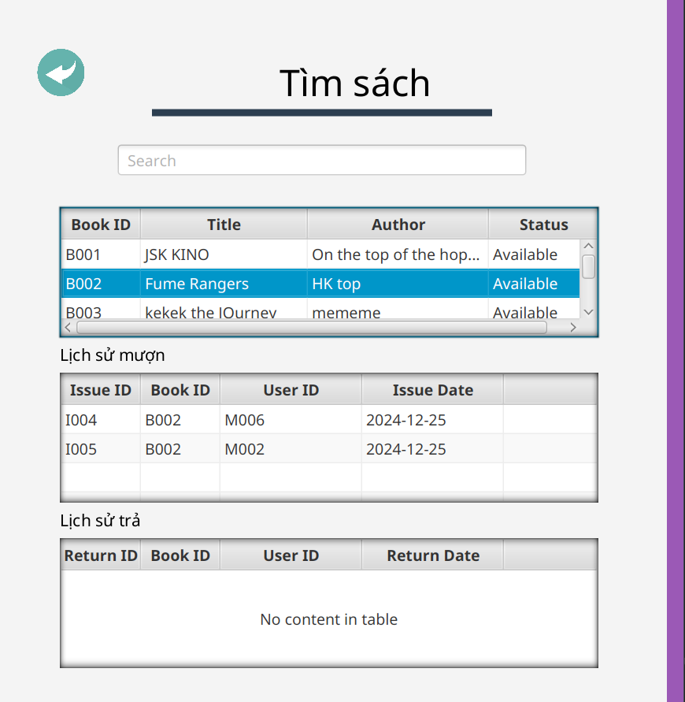
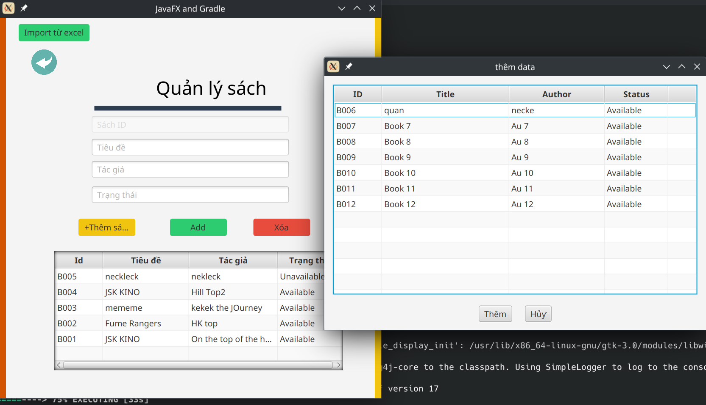

# mkqq - Ứng dụng Quản lý Thư viện

Kho lưu trữ này chứa một ứng dụng quản lý thư viện đơn giản được xây dựng bằng Java và JavaFX. Nó cung cấp các chức năng CRUD (Tạo, Đọc, Cập nhật, Xóa) cơ bản, cho phép quản lý thư viện.

## Tính Năng

- **Quản lý thư viện:** Thêm, xem, sửa xóa sách mới vào thư viện, hội viên, chi tiết mượn, trả sách
- **tìm kiếm sách:** Xem danh sách tất cả các sách trong thư viện, cũng như thông tin chi tiết cho từng cuốn sách, có thê tìm kiếm online, tìm kiếm ngày mượn trả sách.
- **Nhập từ excel:** cho phép nhập dữ liệu sách từ excel thuận tiện.
- **Tính phí trễ hạn:** Tự động tính chi phí trả sách trễ hạn sau 15 ngày.
- **Đăng nhập:** Đăng nhập nhân viên.
## Công Nghệ Sử Dụng

*   **Ngôn ngữ lập trình:** Java
*   **Framework UI:** JavaFX
*   **Công cụ Build:** Gradle (Kotlin DSL)
*   **Cơ sở dữ liệu:** mySQL 

## Cấu Trúc Dự Án

```
app/
├── app-snapshot.png # Ảnh chụp nhanh ứng dụng
├── src/ # Thư mục chứa mã nguồn
│ ├── main/java/
│ │ └── [mkqq]/ 
│ │     ├──BLL/
│ │     ├──DTO/
│ │     ├──DAO/
│ │     ├──Controller/
│ │     └──utils/
│ └── main/resources/ # Các file FXML 
├── build.gradle.kts # File cấu hình dự án Gradle (Kotlin DSL)
├── gradle/ # thư mục chứa file cấu hình gradle
│ ├── wrapper/
│ ├── gradle-wrapper.jar
│ └── gradle-wrapper.properties
└── README.md # File này
```

## Bắt Đầu

Hãy làm theo các bước sau để chạy ứng dụng trên máy tính:

1.  **Clone Kho Lưu Trữ:**
    ```bash
    git clone https://github.com/koilyhuji/mkqq.git
    cd mkqq
    ```

2.  **Thiết lập cơ sở dữ liệu:**

    *   **mariadb, mysql**: Chạy file schema.sql trong thư mục db/ vào cơ sở dữ liệu
        
        ```bash
        mysql > ./db/schema.sql
3.  **Đảm bảo Java và Gradle đã được cài đặt:** Đảm bảo bạn đã cài đặt Java Development Kit (JDK) và Gradle. Bạn có thể tải chúng từ trang web chính thức.

4.  **Điều hướng đến thư mục gốc của dự án trong terminal và Build Dự Án:**
    ```bash
    ./gradlew build
    ```
    (hoặc `gradlew.bat build` trên Windows)

5.  **Chạy Ứng Dụng:**
    ```bash
    ./gradlew run
    ```
     (hoặc `gradlew.bat run` trên Windows)


## Demo Ứng dụng








## Liên Hệ

tạo issue trực tiếp tại đây để liên hệ hoặc  feiwufu64cntt@ntu.edu.vn

---